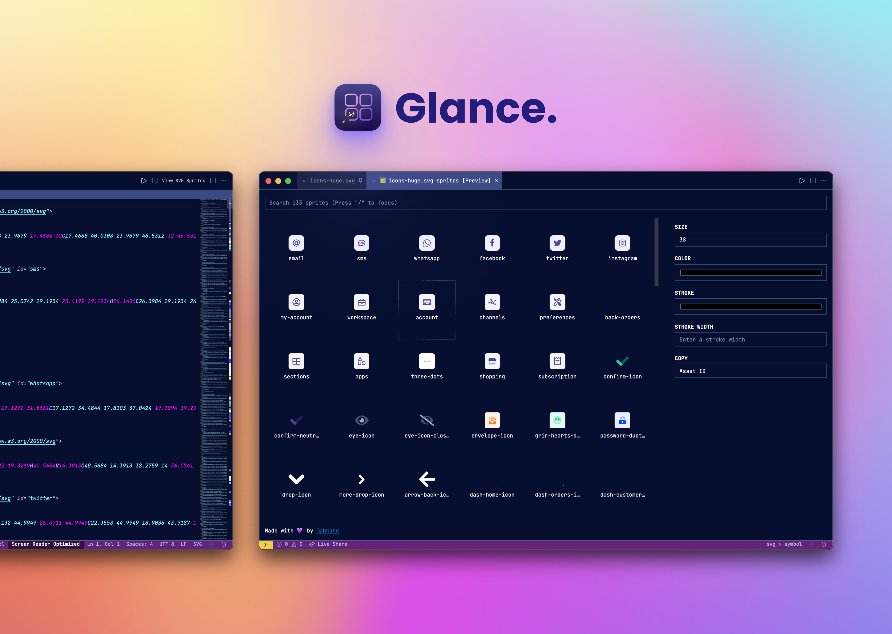

<h1 style="text-align: center; border: none; margin-bottom: 0">Glance</h1>

A `VSCode` extension for viewing [SVG sprites](https://css-tricks.com/svg-symbol-good-choice-icons/) easy-peasy.

## ✨ Features

-   [x] A viewer for SVG sprites
-   [x] Search sprites
-   [x] A function to copy the icon's ID or SVG to clipboard
-   [x] Appearance controls
-   [x] Easily add, edit, and remove SVG sprites

> **Psst** [Watch video to see glance in action! 🔥](https://youtu.be/dK5gAxghYSo)

## 💪 Usage

There are two ways to preview SVG sprites with Glance.

### First method

-   Open a SVG file that has sprites, make sure this is your active editor
-   Click on `Glance` button at the editor title bar. Voila 🎉

### Second method

-   Follow the first above
-   `Cmd+Shift+P`, then type `Glance`
-   Press enter. Voila 🎉

> While at Glance`s preview page, click on an icon to copy it's Id to clipboard. You can configure this at the controls panel to copy the SVG code instead.

<!-- ## Extension Settings

Include if your extension adds any VS Code settings through the `contributes.configuration` extension point.

For example:

This extension contributes the following settings:

-   `myExtension.enable`: enable/disable this extension
-   `myExtension.thing`: set to `blah` to do something -->

## 📝 Release Notes

### 0.0.1

-   Initial release of Glance

### 0.0.2

-   Fix some typos
-   Fix single grid item flush issue

### 0.0.3

-   Fix some typos

### 0.0.4

-   Bug fixes

### 0.0.5

-   Fix activation issue bug

### 0.0.6

-   Activate plugin when runs the Glance command
-   Also activate plugin when user views XML documents

### 0.0.7

-   Implement add single svg or sprites
-   Implement rename sprite asset
-   Implement delete sprite asset

### 0.0.8

-   Use nanoid instead of shortid
